 # #########1
# Paso 1

Voy a crear un contenedor que tendrá un Sistema operativo Ubuntu.

Entro en Docker → Docker Hub
Busco ubuntu 

Selecciono la imagen correspondiente

 
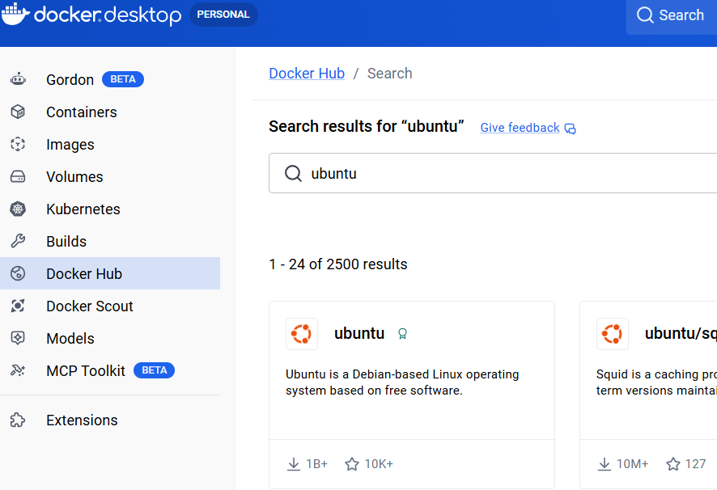

y doy a Run

y le doy nombre al contenedor. (UbuntuMayo2026) . Pero ese contenedor no tiene los permisos apropiados, así que lo elimino.

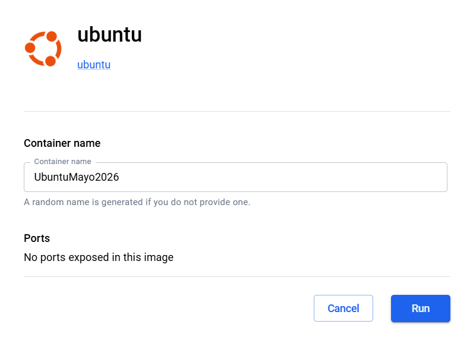

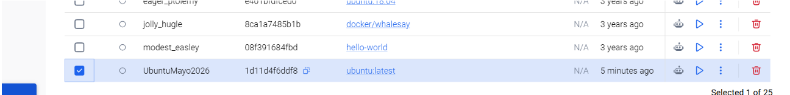

Ahora doy al “Play” de la imagen Ubuntu que la sigo teniendo en Images.
Le pongo el nombre y en este caso no hay puertos que configurar.

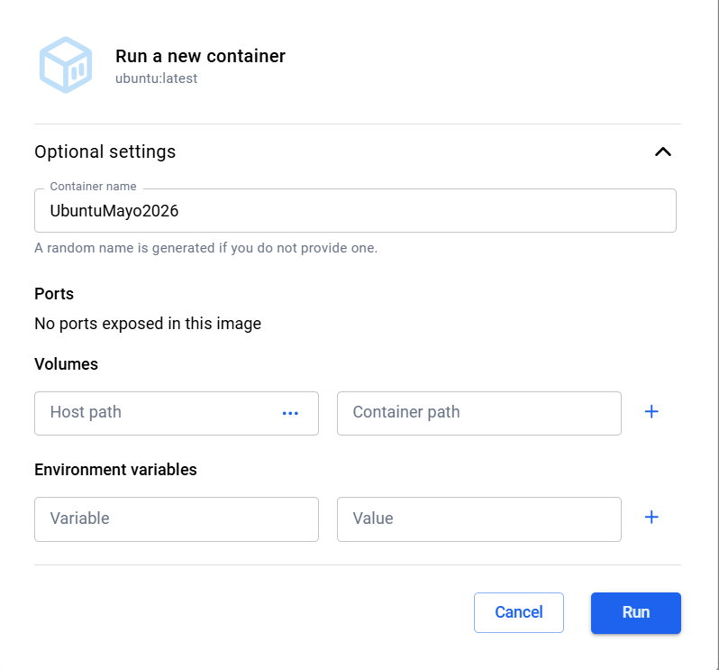

 
Ir a Containers y ejecutarlo si no esté ejecutado

Para acceder a la terminal del contenedor pinchamos en “Terminal”, abajo a la derecha

Ejecuto debug (Hará pull y se descarga la imagen)

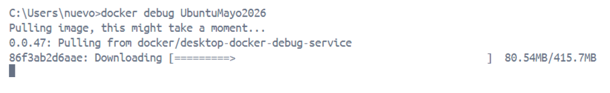 

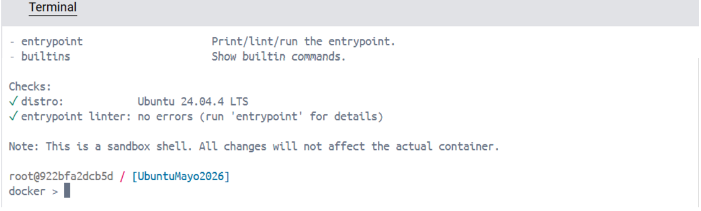

Ejecuto apt-get update e instalo curl

 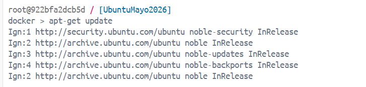

Compruebo que funciona, con curl - -version

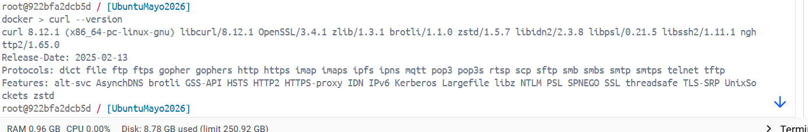
 

Pregunta
¿Con qué comando podrías guardar los cambios del contenedor como una nueva imagen?
Con 
	“docker build - -tag ubuntu:v1 .”

 # Paso 2

Creo el fichero Dockerfile en el raíz de mi proyecto y copio los comandos para actualizar e instalar curl.

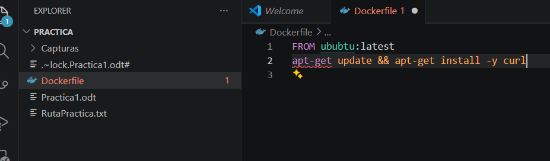

Grabo el fichero y ejecuto en la terminal la creación de la imagen con el comando docker build.
A la imagen le pongo la etiqueta v1

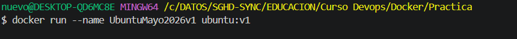

Ejecuto (Crear)  el nuevo contenedor con la nueva imagen creada ( ubuntu:v1) con el comando docker run. Le pongo otro nombre diferente al otro contenedor.

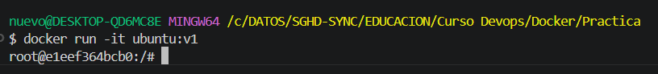

En Docker aparece el nuevo contenedor

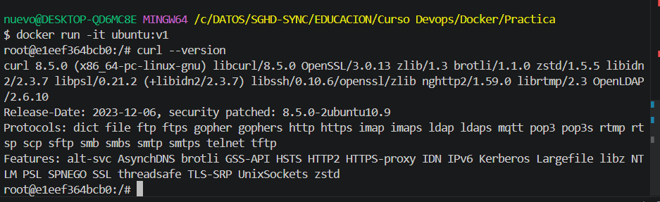 

ejecuto el contendor con la imagen ubuntu:v1

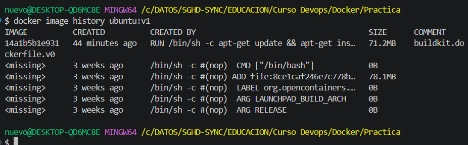

y compruebo que realmente curl está instalado con curl –version

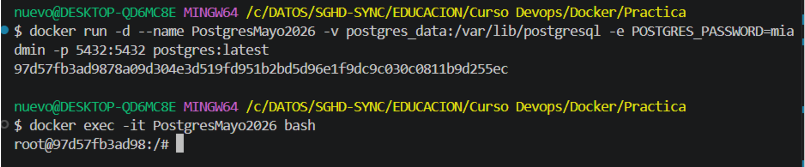 
 

¿Qué comando permite ver las capas de una imagen Docker?
El comando sería :

		 docker image history ubuntu:v1

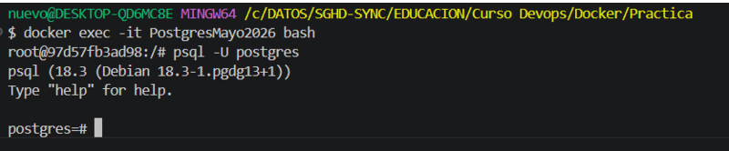 

# #####3:

 
OJO!!!!  el volumen está mal. Debe ser var/lib/postgresql  (sin/data). Si no, da fallo por una actualización.

 
Busco la imagen  de Postgres.
Creo el contendor desde comando.

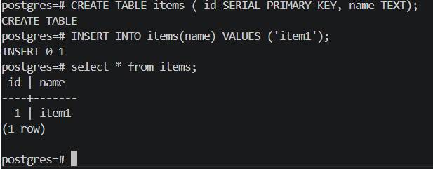

Usuario:postgres
Pwd: miadmin

![17Capturas/17.png)
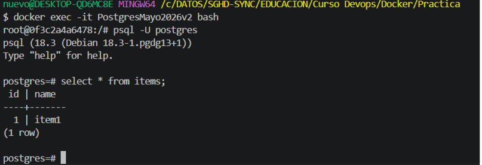

Paro y borro el contenedor
Creo el contenedor v2 usando el mismo volumen

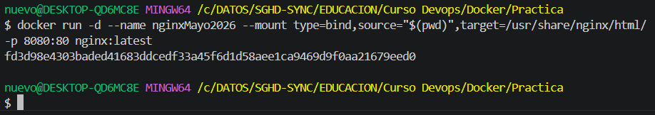

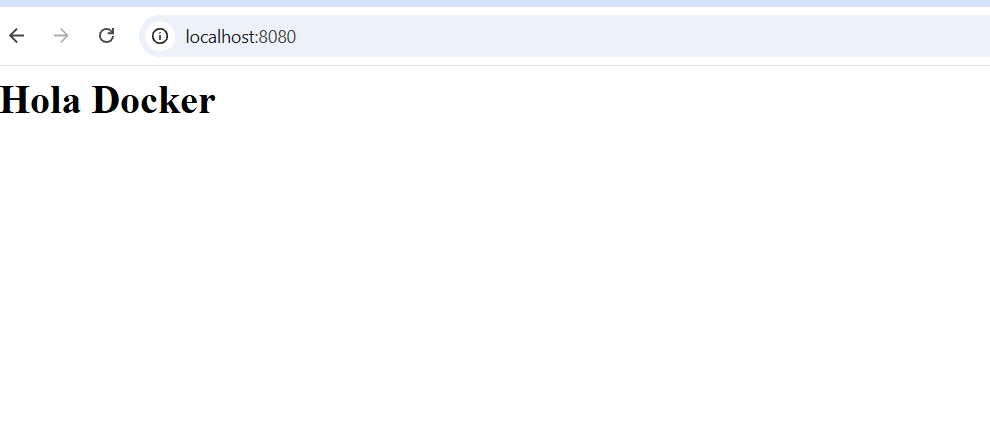

Tras borrar el contenedor y crear uno nuevo, los datos siguen estando en el nuevo.

# ###### 4

Creo el contenedor y lo mapeo al mi puero 8080

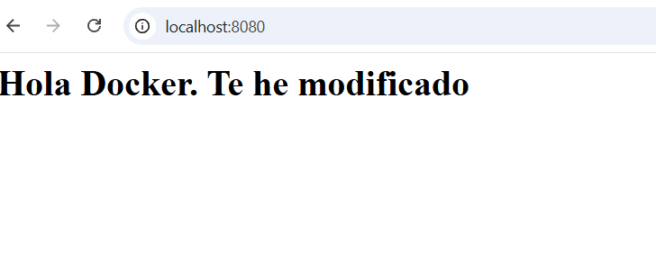

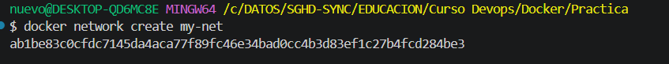

 
Pregunta:

¿Qué ocurre si modificas el archivo index.html en tu máquina?

Como se ve, todo lo que está en mi carpeta Practica ha quedado vinculado al contenedor, por lo que si modifico el fichero index en mi ordenador también se cambiará en el contenedor

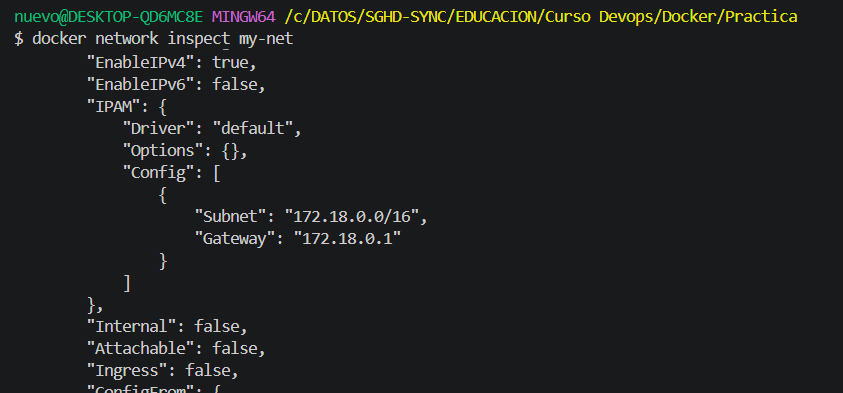

# ######## 5

		Sería: docker volume inspect NombVolumen

# ######## 6

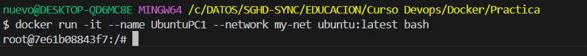

 Miro la configuración de la red que se ha asignado automáticamente

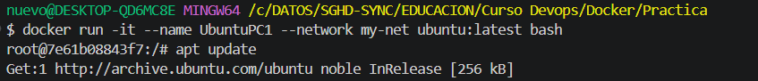 
 

Arranco 2 contendores ubuntu y les instalo para poder hacer ping

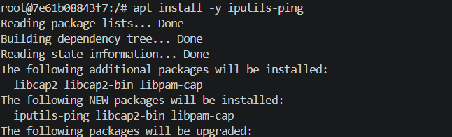 
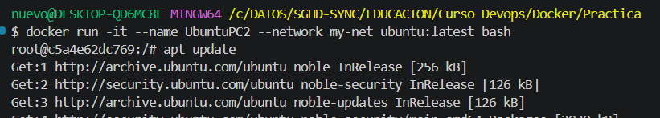 
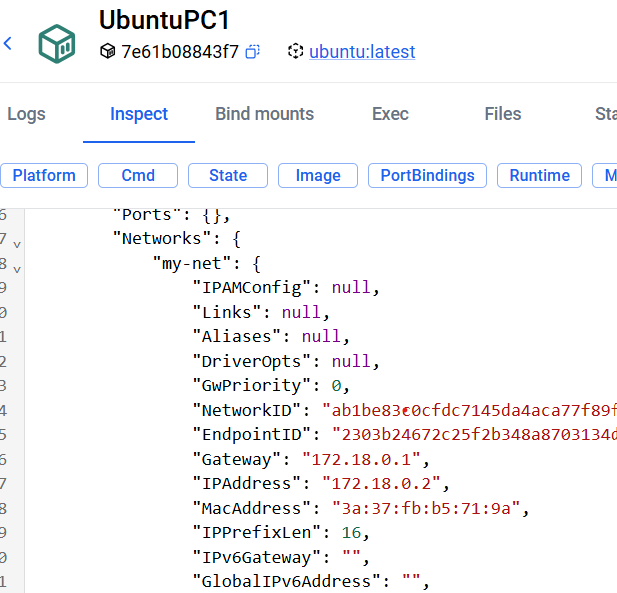

Procedo de la misma forma con UbuntuPC2

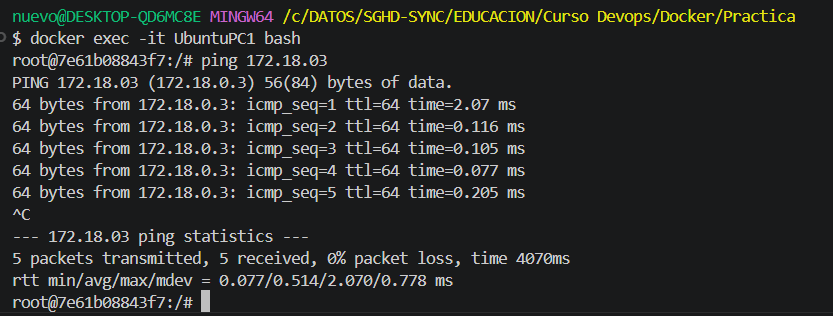 
Inicio los 2 contenedores

Miro que PC1 tiene la IP 172.18.0.2
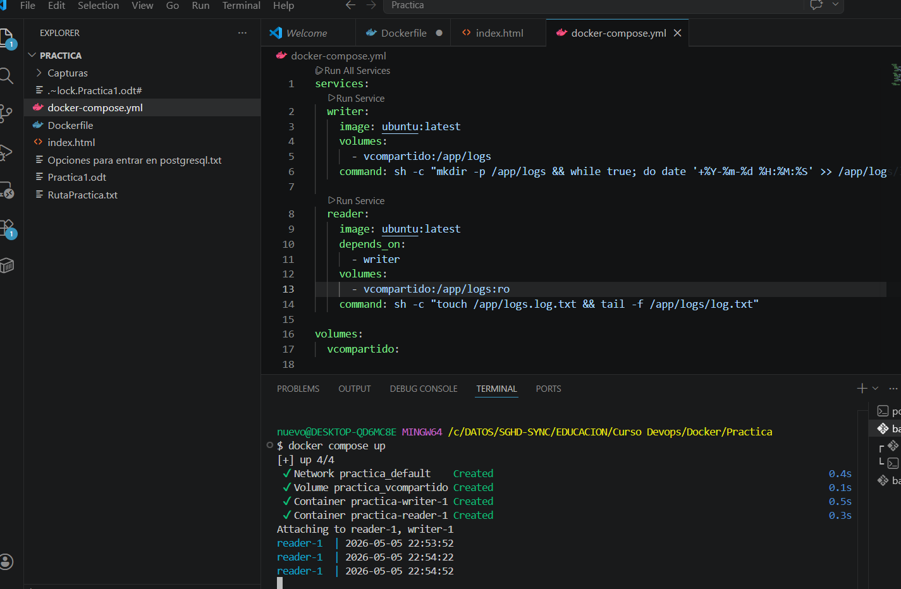
 
y PC 2: 172.18.0.3

Dsde PC1 hago ping a PC2

Entro en el bash de PC1:

 
efectivamente hace ping 

# #########  9

 